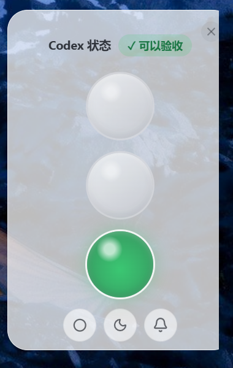
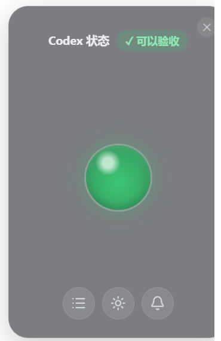
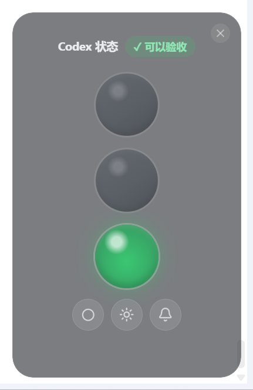
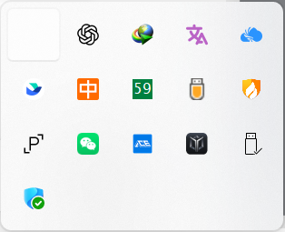

# Codex Traffic Light for Windows

A small Windows floating status light for Codex. It shows Codex activity with a traffic-light style desktop widget, so you can leave Codex running in the background and still know whether it is working, waiting for you, ready for review, or idle.



## Highlights

- Yellow: Codex is working.
- Red: Codex is waiting for confirmation, permission, or an answer.
- Green: the task is complete and ready for review; it automatically returns to idle after 10 minutes.
- Off: idle, initial startup state, or a task was stopped.
- Supports single-light and three-light layouts, light/dark themes, sound toggle, tray menu, and optional launch at startup.
- The widget is display-only during normal use. Status is driven automatically by Codex hooks and local Codex session events.

## Download and Install

1. Open **Releases** on this repository.
2. Download `Codex.Setup.0.1.0.exe`.
3. Run the installer and start the app.
4. In Codex, run `/hooks`.
5. Trust the Codex Traffic Light hooks when Codex asks.

> The current installer is not code-signed. Windows may show a SmartScreen or "Unknown publisher" warning. This is expected for an unsigned open-source installer.

## Usage

After launch, the app stays in the Windows tray and shows a transparent floating status card. In normal use, you do not need to click the lights. They update automatically as Codex state changes.



Dark mode keeps the same status hierarchy and light meanings.



The tray menu lets you show or hide the floating widget, rewrite Codex hooks, inspect configuration paths, toggle launch at startup, and test the lights for troubleshooting.



## Status Mapping

| Codex event | State | Light |
| --- | --- | --- |
| `UserPromptSubmit` / `task_started` / normal activity | `working` | Yellow |
| `PermissionRequest` / `request_user_input` / plan approval | `waiting` | Red |
| `Stop` / `SubagentStop` / normal `task_complete` | `done` | Green |
| `turn_aborted` / app startup / 10 minutes after green | `idle` | Off |

## Local Files

The app writes these files on your machine:

```text
%USERPROFILE%\.codex\bin\codex-light.cmd
%USERPROFILE%\.codex\bin\codex-light.ps1
%USERPROFILE%\.codex\bin\codex-light-hook.ps1
%USERPROFILE%\.codex\hooks.json
%APPDATA%\CodexTrafficLight\state.json
%APPDATA%\CodexTrafficLight\preferences.json
```

State file format:

```json
{
  "state": "working",
  "event": "desktop-task-started",
  "updated_at": 1784280000
}
```

## Command Line Testing

If `%USERPROFILE%\.codex\bin` is in `PATH`, you can run:

```powershell
codex-light working
codex-light done
codex-light waiting
codex-light idle
codex-light status
```

You can also use the full path:

```powershell
& "$env:USERPROFILE\.codex\bin\codex-light.ps1" working
```

## Development

Requires Node.js and npm.

```powershell
npm install
npm run dev
```

Build the renderer:

```powershell
npm run build
```

Build the Windows installer:

```powershell
npm run dist:win
```

The packaged output is written to `release/`.

## Privacy

This tool works locally:

- It does not upload Codex conversation content.
- It does not connect to a third-party status service.
- It reads local Codex hooks and session events only to infer light state.
- State and preferences are stored under `%APPDATA%\CodexTrafficLight`.

## FAQ

**Why does Windows show an unknown publisher warning?**  
The current installer is not code-signed, so Windows may mark it as coming from an unknown publisher. If you downloaded it from this repository's Release page, you can choose to continue.

**Why do the lights not update automatically?**  
Run `/hooks` in Codex and make sure the Codex Traffic Light hooks are trusted. You can also right-click the tray icon and choose the menu item that rewrites Codex hooks.

**Why is there a light testing menu?**  
It is only for troubleshooting the UI and state file. During normal use, Codex drives the light state automatically.

**Why does the light turn off when I stop a task?**  
Clicking Stop in a Codex conversation produces a `turn_aborted` event. That means the current turn is no longer running, so the widget returns to `idle`.

**Why does the green light turn off after a while?**  
Green means the current turn is complete and ready for review. To avoid leaving a stale completion signal on the desktop, it automatically returns to idle after 10 minutes.

## License

MIT
